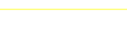

# Vectored

Simple library for drawing SVG images programatially with Elixir.

## Pros and Cons

* No external dependencies at runtime (just this library and xmerl built into Erlang)
* Just low-level SVG structures. Build your own library of shapes on top of it
* Pretty extensible
  * Vectored.Elements.Element provides a `defelement` function that includes a lot of basic functionality
  * Vectored.Renderable protocol allows you to implement your own custom elements however you want

## Installation

Add it to your Mix file

```
{:vectored, git: "https://github.com/geofflane/vectored.git", tag: "0.3.0"}

```

## Example


### Simple image

```elixir
alias Vectored
alias Vectored.Elements.{Path, Svg}

{:ok, svg} =
    Vectored.new()
    |> Svg.with_viewbox(0, 0, 100, 100)
    |> Svg.append(fn ->
        Path.new()
        |> Path.move_to(10, 30)
        |> Path.eliptical_arc_curve(20, 20, 0, 0, 1, 50, 30)
        |> Path.eliptical_arc_curve(20, 20, 0, 0, 1, 90, 30)
        |> Path.quadratic_bezier_curve(90, 60, 50, 90)
        |> Path.quadratic_bezier_curve(10, 60, 10, 30)
        |> Path.close_path()
    end)
    |> Vectored.to_svg_string()

```

Creates an SVG image:


### Programmatic Example

```elixir
defmodule FieldDiagram do
  alias Vectored
  alias Vectored.Elements.{Circle, Defs, Group, Line, Marker, Path, Polyline, Svg, Use}

  @width 160
  @height 300
  @image_los_offset 12
  @hash_offset 70.75
  @hash_width 2
  @hash_stroke 0.5

  @doc """
  Generate an SVG that is a slice of the field to show motions
  """
  @spec generate_svg(number(), number()) :: {:ok, String.t()} | {:error, term()}
  def generate_svg(width, height) do

    Vectored.new()
    |> Svg.with_view_box(width, height)
    |> Svg.with_style("background-color: #eee")
    |> with_field()
    |> Vectored.to_svg_string()
  end

  # This builds the hashmarks and whatnot
  defp with_field(svg) do
    Svg.append(svg, fn ->
     Group.new()
      |> Group.with_id("field")
      |> Group.append(yard_markers())
      |> Group.append(los())
    end)
  end

  defp los() do
    Line.new()
    |> Line.from(0, @image_los_offset)
    |> Line.to(@width, @image_los_offset)
    |> Line.with_stroke("yellow")
    |> Line.with_stroke_width(1)
  end

  def yard_markers() do
    Enum.flat_map(0..@height//3, fn y ->
      if rem(y, 15) == 0 do
        Line.new()
        |> Line.from(0, y)
        |> Line.to(@width, y)
        |> Line.with_stroke("white")
        |> Line.with_stroke_width(1)
        |> List.wrap()
      else
        # Hash marks
        h1 =
          Line.new()
          |> Line.from(@hash_offset, y)
          |> Line.to(@hash_offset + @hash_width, y)
          |> Line.with_stroke("white")
          |> Line.with_stroke_width(@hash_stroke)

        h2 =
          Line.new()
          |> Line.from(@width - @hash_offset, y)
          |> Line.to(@width - @hash_offset - @hash_width, y)
          |> Line.with_stroke("white")
          |> Line.with_stroke_width(@hash_stroke)

        [h1, h2]
      end
    end)
  end
end

with {:ok, svg} <- FieldDiagram.generate_svg(160, 60) do
  File.write!("field.svg", svg)
end
```



## TODO

- Validate attributes (types, required, etc)
- More SVG structures
- More extensive tests (test xml output with xpath?)


## Copyright and License

Copyright (c) 2024, Geoff Lane.

Source code is licensed under the MIT License.
